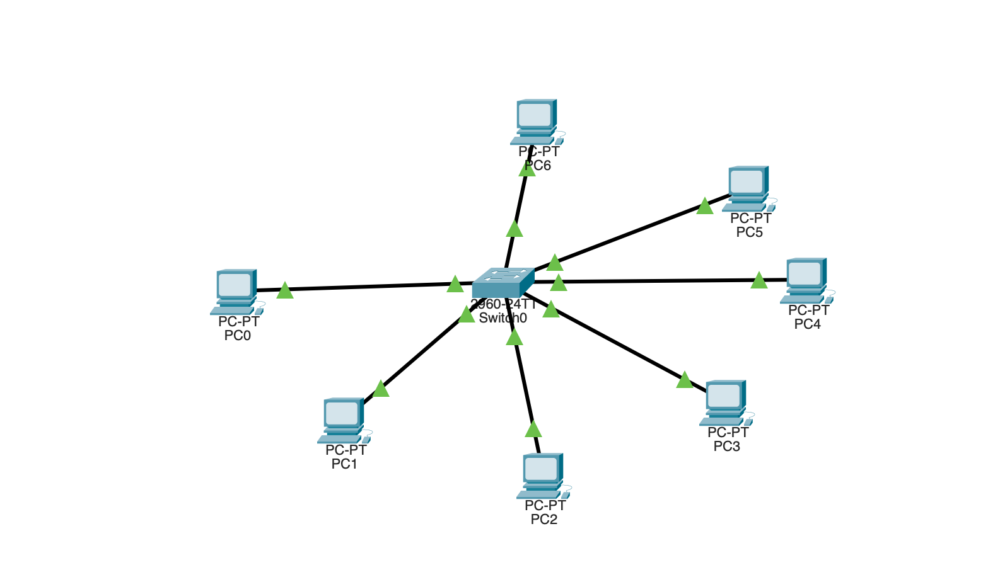
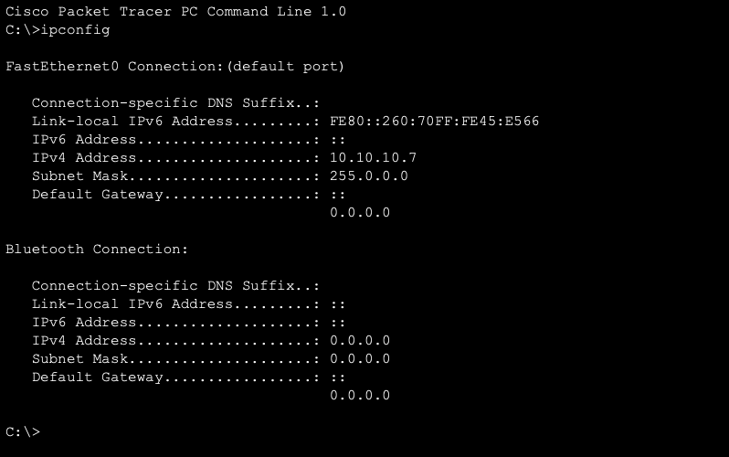
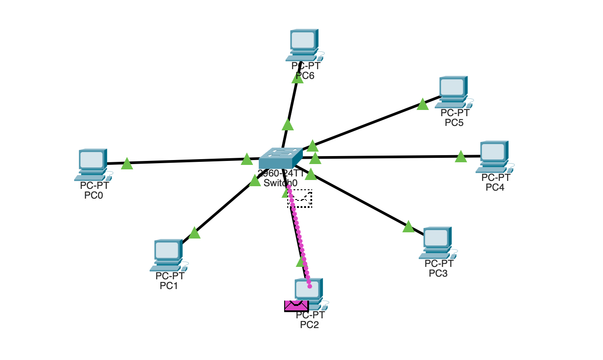

## USING SWITCH

- Using Switch in a network

### Logging Activities :

- added switch
- added six computers
- connected them using stright through cable as they are different device type
  
- Now i will assign ip address to each of the computer
- checking one of the computer to see if ip address was assigned
  
- used simulation mode to see how packet travels through the network
- it is uni-casting , not broadcasting to the entire network like a hub
  

## What I learned

- main difference between a hub and a switch is that the switch has a memory and hub does not
- This memory stores the MAC address of each of the devices connected to the network.
- when a device1 want to send a packet to device2 , we the switch does not flood all the port with the same packet it only sends it to the port where it should go.
- Switch knows which port to forward the packet to as it has a table of the port and the mac address of the devices connected to it .
