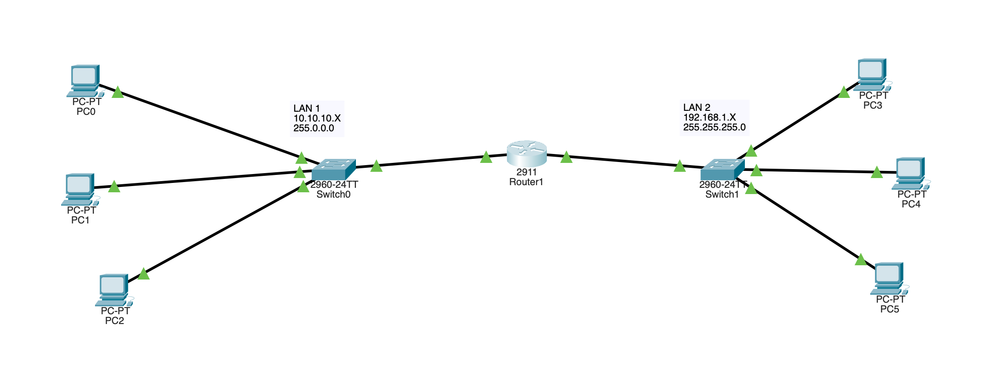

# USING ROUTER

- Using Router in a network

### Logging Activities :

- created LAN 1 using 3 pc and one switch
- created LAN 2 using 3 pc and one switch
- assigned each of the end devices their own ip address
- making sure that the local area network are working using ping

```
    C:\>ping 10.10.10.0

    Pinging 10.10.10.0 with 32 bytes of data:

    Reply from 10.10.10.0: bytes=32 time<1ms TTL=128
    Reply from 10.10.10.0: bytes=32 time<1ms TTL=128
    Reply from 10.10.10.0: bytes=32 time<1ms TTL=128
    Reply from 10.10.10.0: bytes=32 time<1ms TTL=128

    Ping statistics for 10.10.10.0:
        Packets: Sent = 4, Received = 4, Lost = 0 (0% loss),
    Approximate round trip times in milli-seconds:
        Minimum = 0ms, Maximum = 0ms, Average = 0ms
```

```
    C:\>ping 192.168.1.2

    Pinging 192.168.1.2 with 32 bytes of data:

    Reply from 192.168.1.2: bytes=32 time<1ms TTL=128
    Reply from 192.168.1.2: bytes=32 time<1ms TTL=128
    Reply from 192.168.1.2: bytes=32 time<1ms TTL=128
    Reply from 192.168.1.2: bytes=32 time<1ms TTL=128

    Ping statistics for 192.168.1.2:
        Packets: Sent = 4, Received = 4, Lost = 0 (0% loss),
    Approximate round trip times in milli-seconds:
        Minimum = 0ms, Maximum = 0ms, Average = 0ms
```

- Connected the two LAN network using copper straight through cable
- used the gigabit ports of the switch to connect to the router
- turned on the router
- letting the router initialize the connection
- setting the ip address of LAN 1 to 10.0.0.5
- turned on the port in the config settings
- setting the ip address of LAN 2 to 192.168.1.4
- turned the port on in the config settings
- updating default gateway of each computer in the networks
  
- tried to ping a pc in LAN2 from LAN1 and it don't work
- updated the default gateway on both network

```
    C:\>ping 192.168.1.3

    Pinging 192.168.1.3 with 32 bytes of data:

    Request timed out.
    Reply from 192.168.1.3: bytes=32 time<1ms TTL=127
    Reply from 192.168.1.3: bytes=32 time<1ms TTL=127
    Reply from 192.168.1.3: bytes=32 time<1ms TTL=127

    Ping statistics for 192.168.1.3:
        Packets: Sent = 4, Received = 3, Lost = 1 (25% loss),
    Approximate round trip times in milli-seconds:
        Minimum = 0ms, Maximum = 0ms, Average = 0ms

```

## What I learned :

- router is a networking device that forwards data packets between computer network
- first packet is broadcasted and after that the other packets are unicasted , thats why we have a lost packet in our first connection
- connects different network (LAN) not devices
- Its a layer 3 device (working in network layer)
- router has a memory which store the routing table of different networks
- forwarding descisions are made using the ip address
