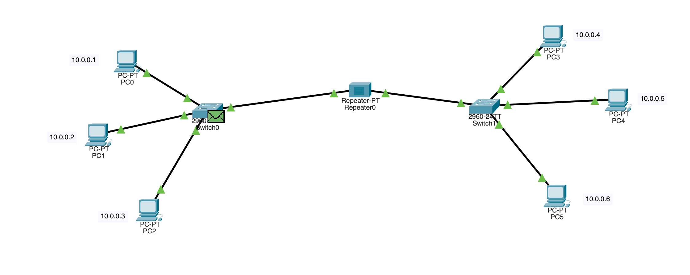

# USING REPEATER

### Logging Activities :

- Created one LAN using two switches
- added end devices (pcs)
- assigned ip address to each of the pcs in the network
- added a repeater between the two sub networks
- now both of the network works as a single network (LAN) without any data loss
  

## What I learned :

- Repeater is used to increase the strength of the signal
- It works over the same network
- it operates in the network layer
- repeater usually is a two port device
